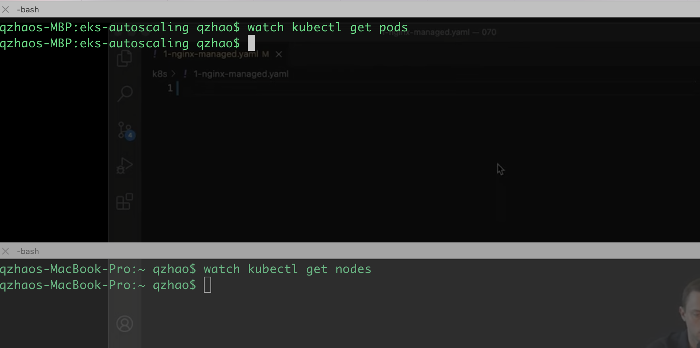
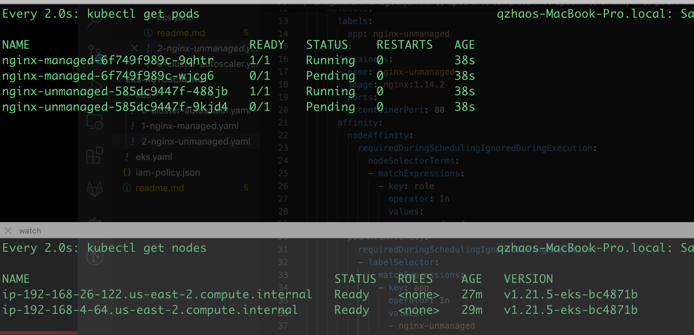
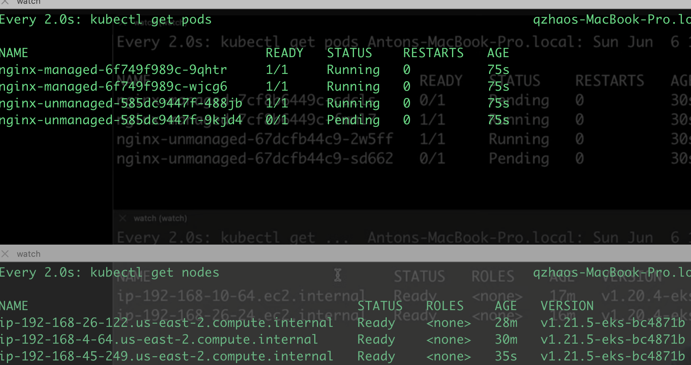
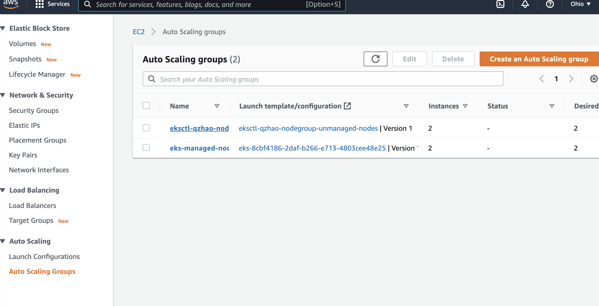
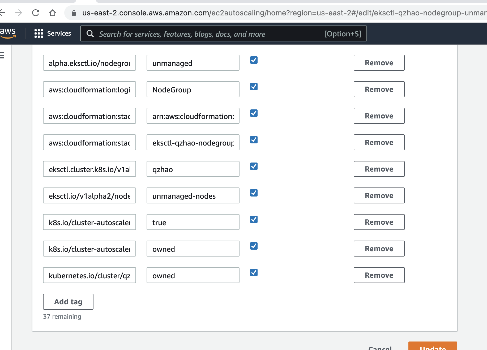
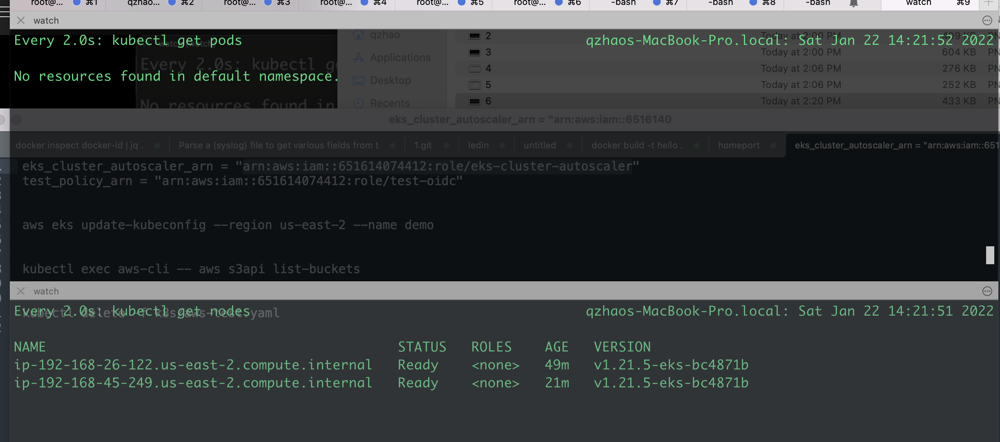

# EKS Cluster Auto Scaling (Kubernetes Autoscaler | EKS Cluster Autoscaler | EKS Autoscale Nodes)

```
  eksctl create cluster -f eks.yaml
```

check autoscaler's version 
# https://github.com/kubernetes/autoscaler/tags

```
kubectl logs -l app=cluster-autoscaler -n kube-system -f
```

```
after delete 
kubectl delete -f 1-nginx-managed.yaml 
kubectl delete -f 2-nginx-unmanaged.yaml
```
All pod will be disappeared, and then wait 15~20 mins, nodes will be disappeared too.







